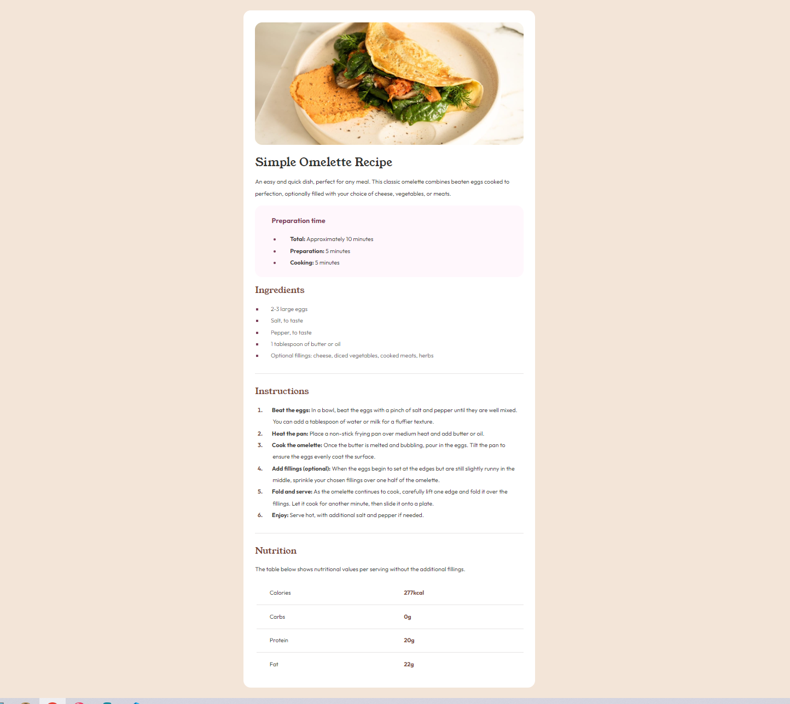

# Frontend Mentor - Recipe page solution

This is a solution to the [Recipe page challenge on Frontend Mentor](https://www.frontendmentor.io/challenges/recipe-page-KiTsR8QQKm). Frontend Mentor challenges help you improve your coding skills by building realistic projects.

## Table of contents

- [Overview](#overview)
  - [Screenshot](#screenshot)
  - [Links](#links)
- [My process](#my-process)
  - [Built with](#built-with)
  - [What I learned](#what-i-learned)
  - [Continued development](#continued-development)
  - [Useful resources](#useful-resources)
- [Author](#author)
- [Acknowledgments](#acknowledgments)

**Note: Delete this note and update the table of contents based on what sections you keep.**

## Overview

### Screenshot



### Links

- Live Site URL: [Add live site URL here](https://your-live-site-url.com)

## My process

### Built with

- Semantic HTML5 markup
- CSS
- Flexbox

### What I learned

I frequently overlook HTML and CSS, drawn to the more "code-like" aspects of learning. However, whenever I consistently engage with these two technologies, I discover incredibly useful tools, such as these.

```css
#prep-time li::marker {
  color: #7e425c;
}
```

```css
#ingredients li {
  text-indent: 1.2em;
}
```

It's very convenient to precisely focus on how the text in a list interacts with its bullet points.

### Continued development

I couldn't quite figure out why I had to make the image bigger on mobile view to stretch it across the whole screen width. Maybe it had something to do with using "normalize.css". And yeah, I had to resort to using negative margins to get the image to stay where I wanted it, but honestly, I'm not sure why that worked either.

## Author

- Website - [Gabriel de Oliveira](https://gabeoliveira.vercel.app/)
- Frontend Mentor - [@GabrielFdeOliveira](https://www.frontendmentor.io/profile/GabrielFdeOliveira)

## Acknowledgments

Big thanks to Stephens Gonçalves for introducing me to Frontend Mentor and for providing valuable advice to enhance my personal development.
